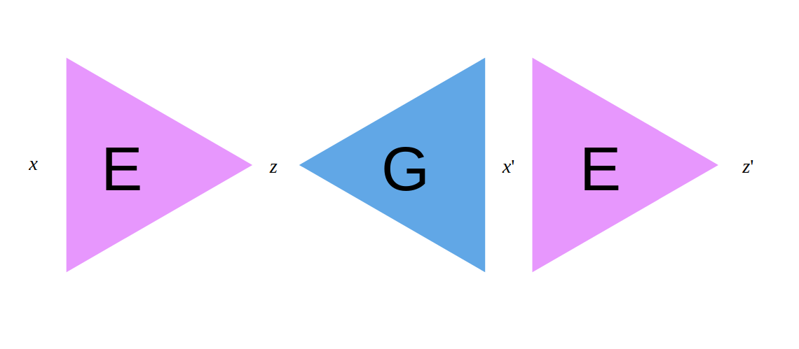

# Introspective Variational Autoencoder

This module contains the fundamental building blocks to implement
the Introspective Variational Autoencoder (IntroVAE), introduced by
[Huagn *et al* 2018](https://arxiv.org/abs/1807.06358)

Since the main contribution of IntroVAEs is the training regime, the
methodology can be applied to any variational network. Therefore, included here are style-based 
architectures from [Karras *et al* 2018](https://arxiv.org/abs/1812.04948) using
Adaptive Instance Normalisation, as well as the skip and residual connections
used in their [latest work (2019)](https://arxiv.org/abs/1912.04958). Such additions make for predictably stable
adversarial training.

This implementation borrowed the hairy loss implementation from `bbeatrix` available on 
[GitHub](https://github.com/bbeatrix/introvae). The Adaptive Instance Normalisation
Layer was borrowed from `manicman1999` available [here](https://github.com/manicman1999/StyleGAN-Keras). Additionally,
the [Nvidia Labs GitHub](https://github.com/NVlabs/stylegan2/) served as some interesting and helpful reading.

# Demo 64x64 Anime

    <figure>
        
        <figcaption>Fig.1 - Training Progress.</figcaption>
         
    </figure>
    <figure>
        
        <figcaption>Fig.2 - Interpolations between real images</figcaption>
         
    </figure>
    <figure>
        
        <figcaption>Fig.3 - Random Samples (mean = 0, std. = 1)</figcaption>
         
    </figure>

 

  
